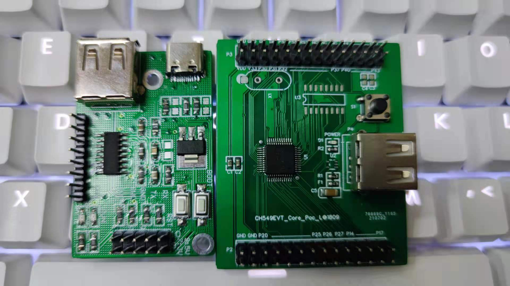

.. _ch549:

CH549
=========
`WCH <http://www.wch.cn/>`_ : ``8051`` ``48MHz`` ``USB FS OTG`` ``4x UART`` ``LDO`` ``USB-PD``

:ref:`ch554` --> :ref:`ch549`

.. contents::
    :local:
    :depth: 1

Xin简介
-----------
`Tags <https://github.com/SoCXin/CH549>`_ : :ref:`low` / :ref:`usb_pd`

.. image:: ./images/CH549.png
    :target: http://www.wch.cn/products/CH549.html

规格参数
~~~~~~~~~~~

兼容MCS51的增强型E8051内核，79%指令是单字节单周期指令，3KB BootLoader + 60KB CodeFlash，2K xRAM + 256B iRAM，1K DataFlash。

支持 USB-Host主机模式和 USB-Device设备模式，内置FIFO支持最大64字节数据包,支持DMA，支持 USB 2.0 全速 12Mbps，支持USB PD和Type-C。

通信接口包括4组异步串口、8路PWM和16通道电容触摸按键，其它包括1路主从SPI，16路12位ADC，支持电压比较；内置3组定时器和3路信号捕捉。

基本参数
^^^^^^^^^^^

* 发布时间：
* 参考价格： `￥5.86 <https://item.szlcsc.com/341226.html>`_
* 制程工艺：
* 供货周期：
* 处理性能：:ref:`level1`
* 封装规格：SOP16/QFN28/:ref:`LQFP48`
* 运行环境：-40°C to 85°C
* RAM容量：2 KB
* Flash容量：63 KB

特征参数
^^^^^^^^^^^

* 48 MHz :ref:`mcs51`
* SPI x 2 + UART x 4 (16C550/6Mbps)
* USB H/D
* Type-C CC控制
* 16通道12位ADC，支持电压比较

.. hint::
    最有特色的一点是在QFN28封装内有两个USB OTG外设，配置的Flash容量也比较大。

芯片架构
~~~~~~~~~~~

功耗参数
^^^^^^^^^^^

* 电压范围：3.0 to 5.5 V
* 功耗范围：

Xin选择
-----------

.. contents::
    :local:

品牌对比
~~~~~~~~~

系列对比
~~~~~~~~~

版本对比
~~~~~~~~~

必选理由
~~~~~~~~~

基于8051内核，继承CH552/CH554拥有大量开源项目适配，适合USB类设备开发。

就性价比而言，随着CH552/CH554的退出成为更好的替换品，但是相对于各种低成本新方案，性价比优势不再明显，8051的资源通用性也较受限。

Xin应用
-----------

.. contents::
    :local:

开发板
~~~~~~~~~~

.. _ch549_pd:

USB-PD
~~~~~~~~~~~~

.. _ch549_dap:

CMSIS-DAP
~~~~~~~~~~~~

 `CMSIS-DAPbyWCH <https://github.com/kaidegit/CMSIS-DAPbyWCH>`_

* cheap. The MCU is a 8051 core, and the price is less than 5RMB. It is cheaper than CH32F103 to make a CMSIS-DAP debugger.
* can also be small. The CH549 also have a QFN28 package.
* can debug both ARM and RISC-V core MCU.

Xin总结
--------------

.. contents::
    :local:

能力构建
~~~~~~~~~~~~~

要点提示
~~~~~~~~~~~~~

问题整理
~~~~~~~~~~~~~

