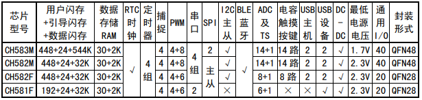

.. _NO_013:
.. _ch583:

CH583
============

* `WCH <http://www.wch.cn/products/CH583>`_ : ``WCH`` ``RISC-V4A`` ``20MHz`` ``USB`` ``AES-128`` ``BLE5.3`` ``1.7V`` ``QFN48`` ``QFN28``
* `Tags <https://github.com/SoCXin/CH583>`_ : :ref:`ulp` / :ref:`low` / :ref:`ble` / :ref:`usb`  

.. contents::
    :local:
    :depth: 1

Xin简介
-----------

.. image:: ./images/CH583.png
    :target: http://www.wch.cn/products/CH583.html

规格参数
~~~~~~~~~~~

集成 BLE无线通讯的32位 :ref:`wch_riscv4a` 微控制器。片上集成2Mbps低功耗蓝牙BLE 通讯模块、2个全速USB主机和设备控制器及收发器、2个SPI、4个串口、ADC、触摸按键检测模块、RTC等丰富的外设资源。

基本参数
^^^^^^^^^^^

* 发布时间：
* 参考价格：￥4.5
* 制程工艺：
* 供货周期：
* 处理性能：
* 封装规格：QFN48
* 运行环境：-40°C to 85°C
* RAM容量：32 KB
* Flash容量：1 MB

特征参数
^^^^^^^^^^^

* 80 MHz :ref:`wch_riscv4a` (青稞V4)
* 2x USB FS Host/Device
* 32KB SRAM，1MB Flash，支持ICP、ISP和IAP，支持OTA无线升级
* 2.4GHz RF收发器和基带及链路控制，支持BLE5.1
* 支持2Mbps、1Mbps、500Kbps、125Kbps，接收灵敏度-98dBm，可编程+7dBm发送功率
* 4组UART，2组SPI，12路PWM，1路IIC
* 内置温度传感器
* 内置RTC，支持定时和触发两种模式
* 40个GPIO，其中4个支持5V信号输入

模拟性能
^^^^^^^^^^^
``TouchKey`` ``12-bit ADC`` 

* 12-bit ADC (14ch)
* 14x TouchKey

芯片架构
~~~~~~~~~~~

``1.56 DMIPS``

低功耗两级流水线

.. image:: ./images/CH583Core.png
    :target: http://www.wch.cn/products/CH583.html

功耗参数
^^^^^^^^^^^
``低功耗产品``

* 支持 3.3V 和 2.5V 电源，CH583M 支持 1.8V
* 内置 DC-DC 转换，可降低功耗
* 空闲模式 Idle：1.6mA
* 暂停模式 Halt：320uA
* 睡眠模式 Sleep：0.7uA～2.8uA 多档
* 下电模式 Shutdown：0.2uA～2.3uA 多档

`芯片手册 <http://www.wch.cn/downloads/CH583DS1_PDF.html>`_

连接能力
~~~~~~~~~~~

.. _ch583_ble:

BLE
^^^^^^^^^^^
``BLE 5.3`` ``-98dBm`` ``+7dBm``

* 接收灵敏度-98dBm，可编程+7dBm发送功率
* BLE 符合 Bluetooth Low Energy 5.0规范

pathloss=40+25log(d)

.. image:: ./images/路径损耗.jpg
    :target: https://blog.csdn.net/qq_15391889/article/details/87937452

.. _ch583_usb:

USB
^^^^^^^^^^^
``USB FS OTG``

* 2 组独立的 USB 控制器和收发器
* 15 个端点，支持 DMA，支持 64 字节数据包
* 集成 USB 2.0 全速收发器 PHY，无需外围器件支持全/低速的 Host 主机和 Device 设备模式

Xin选择
-----------

.. contents::
    :local:
    :depth: 1

品牌对比
~~~~~~~~~

对比包括性能和性价比两个维度，基于 :ref:`bt` 对比的品牌较多，在此重点对比可替换方案和高性价比

.. list-table::
    :header-rows:  1

    * - :ref:`vendor`
      - :ref:`CoreMark`
      - SRAM/ROM
      - :ref:`ble`
      - :ref:`sleep`
      - :ref:`peripherals`
      - Package
    * - :ref:`ch583`
      -
      - 32KB/1 MB
      - BLE5.3
      - 0.7uA
      - 2/4/2
      - QFN48
    * - :ref:`esp32c3`
      - 407
      - 512KB/384KB
      - BLE5.0
      - 5uA
      - 0/2/3
      - QFN32/QFN28

系列对比
~~~~~~~~~

.. list-table::
    :header-rows:  1

    * - :ref:`wch`
      - :ref:`architecture`
      - :ref:`CoreMark`
      - SRAM/ROM
      - wireless
      - USB/UART/ETH
      - Sleep
    * - :ref:`ch583`
      - :ref:`wch_riscv4a`
      - 20MHz
      - 32KB/1 MB
      - BLE5.1(104dBm)
      - 2xOTG/4/X
      - 0.7-2.8uA
    * - :ref:`ch573`
      - :ref:`wch_riscv3a`
      - 20MHz
      - 18KB/512KB
      - BLE4.2(101dBm)
      - OTG/4/X
      - 0.3-6.0uA

    * - :ref:`ch579`
      - :ref:`cortex_m0`
      - 40MHz
      - 32KB/250KB
      - BLE4.2(96dBm)
      - OTG/4/10Mbps
      - 0.3-3.0uA

版本对比
~~~~~~~~~

.. _ch582:

CH582
^^^^^^^^^^^
``CH582M`` ``CH582F`` ``￥3.68``

CH582 相比 :ref:`ch583` 少了 ``SPI1`` 主机和 512KB 闪存用于存储数据或备份代码，不支持最低 ``1.7V`` 电源电压供电。

CH581 则基于 CH582 去掉了一组 USB、触摸按键检测模块、I2C 模块和两个串口，FlashROM总容量仅 256KB，ADC 不支持 DMA。

.. hint::
    零售价格 `￥3.68 <https://item.szlcsc.com/3226374.html>`_ 和小封装(QFN28)是优势，还包括有两个USB OTG外设（ADC缩水）。

Xin应用
-----------

.. contents::
    :local:
    :depth: 1

开发板
~~~~~~~~~~

.. image:: images/B_CH583.jpg
    :target: https://item.taobao.com/item.htm?spm=a1z09.2.0.0.53f62e8dtXVPY8&id=658709610766&_u=pgas3eu0091

