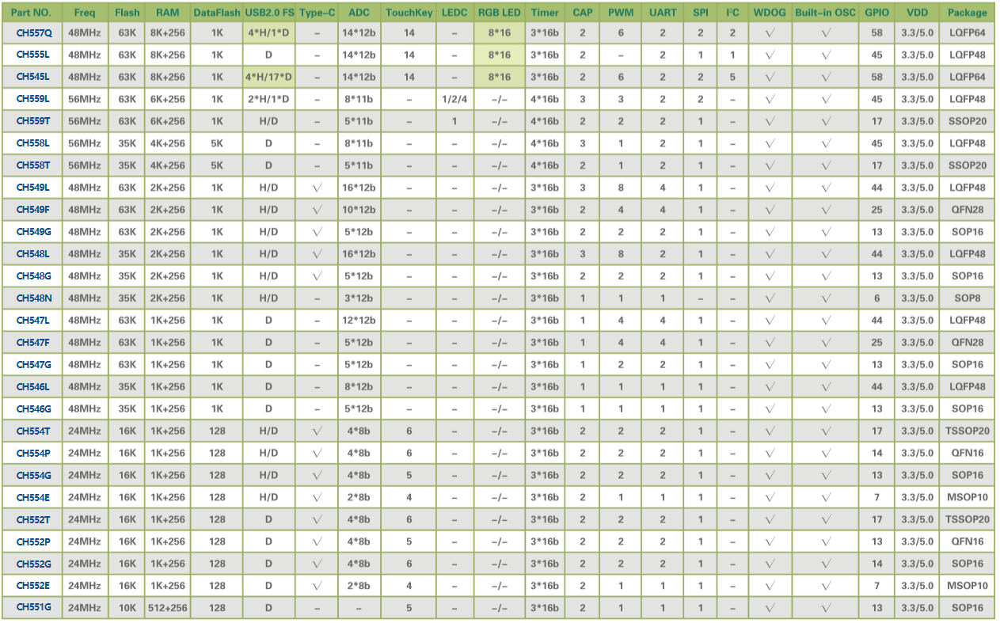
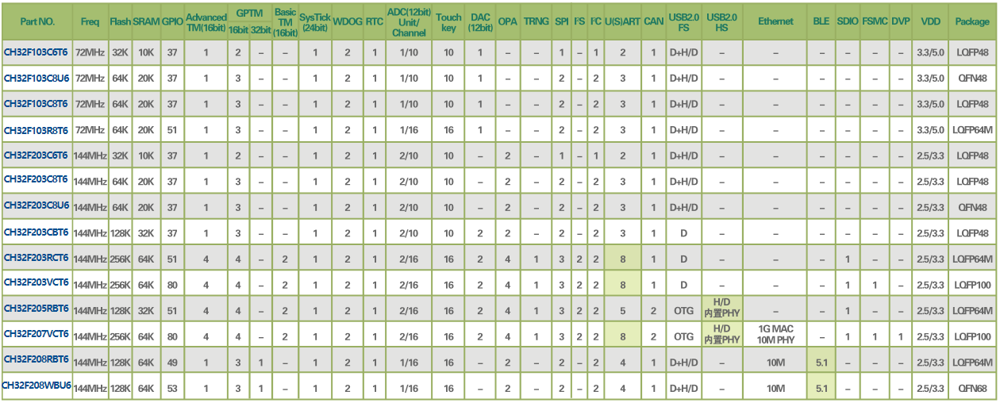
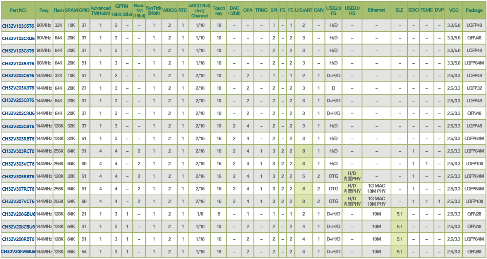
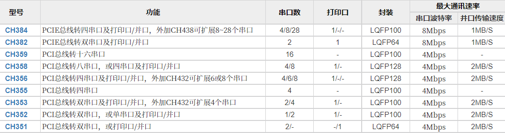

.. _wch:

WCH
============

``RISC-V`` ``Qingke`` ``8051`` ``USB-HS(PHY)`` ``USB-SS(PHY)`` ``USB-PD`` ``Ethernet`` ``10Mbps(PHY)`` ``1Gbps(MAC)`` ``HSPI`` ``SerDes`` ``UART`` ``BLE``

.. contents::
    :local:
    :depth: 1

公司简介
-----------

`南京沁恒微电子 <http://www.wch.cn/>`_ 成立于2004年，是一家专注于连接技术和MCU内核研究的射频与高速数模混合集成电路设计公司，提供以太网、蓝牙无线网络、USB和PCI类等接口芯片及集成上述接口的MCU+单片机。

该厂商的转换芯片如CH340普及率非常高，凭借在有线连接上的积累，推出的可编程器件都具备非常丰富的连接资源如USB/UART/Ethernet，产品品类非常丰富，同时也具备很高的性价比。

.. contents::
    :local:
    :depth: 1

优势确认
~~~~~~~~~~~~~
``产品线丰富`` ``低成本`` ``连接``

.. list-table::
    :header-rows:  1

    * - :ref:`wch`
      - :ref:`wch_eth`
      - :ref:`wch_usb`
      - :ref:`wch_ble`
      - :ref:`wch_8051`
      - :ref:`wch_arm`
      - :ref:`wch_rv`
    * - :ref:`low`
      - :ref:`ch579`
      - :ref:`ch552`
      - :ref:`ch573`
      - :ref:`ch549`
      - :ref:`ch32f103`
      - :ref:`ch32v103`
    * - :ref:`ulp`
      -
      - :ref:`ch569`
      - :ref:`ch583`
      -
      - :ref:`ch32f208`
      - :ref:`ch32v307`

产品定位
~~~~~~~~~~~~~

专注于连接市场，开始向无线通信和自研核心发展，产品线非常丰富，在物联网市场有明显的识别度，弱势在于应用开发，厂商没有给出足够的引导案例和软件框架。

在有线连接领域，工程师接受度比较高，但是在大的项目中，还是不太愿意考虑

技术积累
~~~~~~~~~~~~~

主要的方案在USB领域，然后以太网连接领域，受限于开发资源，需要编程的器件在生态上并没有太大优势

`WCH应用方案 <http://www.wch.cn/application.html>`_

.. note::
    厂商例程代码还是有点“乱”，和大多数国产MCU厂商一样，软资源不够全面也不够规范，可能在这上面的资源投入很有限

通信领域
-------------

.. image:: ./images/wch.png
    :target: http://special.wch.cn/zh_cn/interface_conversion_expert/

.. contents::
    :local:
    :depth: 1

.. _wch_eth:

ETH++
~~~~~~~~~~~

.. list-table::
    :header-rows:  1

    * - :ref:`wch`
      - :ref:`architecture`
      - :ref:`CoreMark`
      - SRAM/ROM
      - Characteristics
      - Ethernet
      - Package
    * - :ref:`ch563`
      - :ref:`arm7`
      -
      - 64KB/224KB
      - 480M USB
      - 100M PHY
      - LQFP64M
    * - :ref:`ch579`
      - :ref:`cortex_m0`
      -
      - 32KB/250KB
      - BLE 4.2
      - 10M PHY
      - QFN48/QFN28
    * - :ref:`ch32v208`
      - :ref:`wch_riscv4c`
      -
      -
      - BLE 5.3
      - 10M PHY
      -
    * - :ref:`ch32f208`
      - :ref:`cortex_m3`
      -
      -
      - BLE 5.3
      - 10M PHY
      -

`独立以太网方案 <http://www.wch.cn/products/categories/47.html?pid=4>`_ 主要包括转并口/SPI/串口等

.. image:: ./images/eth.png
    :target: http://www.wch.cn/products/category/4.html#data

.. _wch_usb:

USB++
~~~~~~~~~~~

.. _wch_usb_hs:

USB-HS
^^^^^^^^^^^
``USB-HS(PHY)`` ``480Mbps``

芯片集成USB2.0 HS PHY器件实现高速通信(480Mbps)，在该细分领域上 :ref:`st` 的STM32F7系列部分型号有USB2.0 PHY集成的方案。

.. hint::
    建议45MB/s以内的应用场景

.. list-table::
    :header-rows:  1

    * - :ref:`wch`
      - :ref:`architecture`
      - SRAM/ROM
      - USB
      - :ref:`wch_usb_hs`
      - PHY
      - MAC
    * - :ref:`ch563`
      - :ref:`arm7`
      - 64KB/224KB
      - 1
      - 480Mbps
      - 100Mbps
      - 100Mbps
    * - :ref:`ch32f207`
      - :ref:`cortex_m3`
      - 64KB/256KB
      - 2
      - 480Mbps
      - 10Mbps
      - 1Gbps
    * - :ref:`ch32v307`
      - :ref:`wch_riscv4a`
      - 64KB/256KB
      - 2
      - 480Mbps
      - 10Mbps
      - 1Gbps

.. _wch_usb_ss:

USB-SS
^^^^^^^^^^^
``USB-SS(PHY)`` ``5Gbps`` ``384MB/s``

.. hint::
    建议384MB/s以内的应用场景

.. list-table::
    :header-rows:  1

    * - :ref:`wch`
      - :ref:`architecture`
      - USB
      - USB Type
      - :ref:`wch_usb_hs`
      - :ref:`wch_usb_ss`
      - USB Hub
    * - :ref:`ch569`
      - :ref:`wch_riscv3a`
      - 1
      - OTG
      - √
      - √
      - √

.. _wch_usb_fs:

USB-FS
^^^^^^^^^^^
``800KB/s``

.. hint::
    建议800KB/s以内的应用场景

.. list-table::
    :header-rows:  1

    * - :ref:`wch`
      - Mark
      - RAM
      - Flash
      - UART/SPI
      - BLE
      - USB
      - Ethernet
    * - :ref:`ch545`
      - :ref:`mcs51`
      - 32K
      - 250K
      -
      -
      -
      -
    * - :ref:`ch557`
      - :ref:`mcs51`
      - 32K
      - 250K
      -
      -
      -
      -

`独立USB方案 <http://www.wch.cn/products/categories/22.html?pid=1#data>`_

.. image:: ./images/wchusb.png
    :target: http://special.wch.cn/zh_cn/USBChips/#/

.. hint::
    :ref:`wch` 的MCU基本标配USB FS外设，而且在对标同类产品时，往往配置更多数量的USB，或者集成USB PHY器件

.. _wch_ble:

BLE++
~~~~~~~~~~~

.. image:: ./images/BLE.png
    :target: http://special.wch.cn/zh_cn/mcu/

.. list-table::
    :header-rows:  1

    * - :ref:`wch`
      - Mark
      - RAM
      - Flash
      - UART/SPI
      - BLE
      - USB
      - Ethernet
    * - :ref:`ch579`
      - :ref:`cortex_m0`
      - 32K
      - 250K
      - 4/2
      - 4.2(+3dBm)
      - USB H/D
      - 10M
    * - :ref:`ch573`
      - :ref:`wch_riscv3a`
      - 18K
      - 512K
      - 4/1
      - 4.2(+5dBm)
      - USB H/D
      - X
    * - :ref:`ch583`
      - :ref:`wch_riscv4a`
      - 32K
      - 1024K
      - 4/1
      - 5.1(+6dBm)
      - 2 x USB
      - X

内核分类
------------

.. contents::
    :local:
    :depth: 1

.. _wch_8051:

MCS51
~~~~~~~~~~~~
``8051`` ``MCU``
 

.. list-table::
    :header-rows:  1

    * - :ref:`wch`
      - :ref:`architecture`
      - SRAM
      - Flash
      - UART/SPI
      - BLE
      - USB
      - Ethernet
    * - :ref:`ch552`
      - 24MHz
      - 2KB
      - 16KB
      -
      -
      -
      -
    * - :ref:`ch549`
      - 48MHz
      - 2KB
      - 60KB
      -
      -
      -
      -
    * - :ref:`ch543`
      - 48MHz
      - 512B
      - 16KB
      -
      -
      -
      -

.. toctree::
    :maxdepth: 1

    CH545 <CH545>
    CH557 <CH557>
    CH552 <CH552>
    CH549 <CH549>
    CH543 <CH543>

.. _wch_arm:

Cortex
~~~~~~~~~~~~

.. toctree::
    :maxdepth: 1

    CH32F103 <CH32F103>
    CH32F207 <CH32F207>
    CH32F208 <CH32F208>

.. note::
    2012年起陆续引入Cortex-M内核，我们加入了网络、USB2.0等高速接口，并设计了高速DMA仲裁机制，推出CH32F103等通用MCU芯片，适用于软件兼容、硬件引脚兼容、接口更专业的成熟生态应用。

.. toctree::
    :maxdepth: 1

    CH579 <CH579>
    CH563 <CH563>

.. _wch_rv:

RISC-V
~~~~~~~~~~~~

.. toctree::
    :maxdepth: 1

    Qingke内核 <riscv>

* 2017年开始关注并研究RISC-V开源指令集的32位MCU架构，针对快速中断响应、高带宽数据DMA进行优化
* 2019年推出基于RISC-V3A处理器的CH32V103单片机，内嵌BLE低功耗蓝牙的CH57X系列
* 2020年初推出128位数据宽度和双层DMA架构的高吞吐量的CH56X系列，现已扩展出浮点型V4F，精简型V2A，增强型V3A/V4A/V4B/V4C等内核产品

.. toctree::
    :maxdepth: 1

    CH32V103 <CH32V103>
    CH32V307 <CH32V307>
    CH32V208 <CH32V208>

.. image:: ./images/CH5V.png
    :target: http://special.wch.cn/zh_cn/mcu/

.. toctree::
    :maxdepth: 1

    CH569 <CH569>
    CH568 <CH568>
    CH583 <CH583>
    CH573 <CH573>

外设芯片
------------

纵览 :ref:`wch` 当下所有产品，其核心技术在于自主开发的 :ref:`wch_riscv` 内核，在USB领域的多年积累，特别是USB HS集成PHY的差异化定位，相对竞品方案的集成度和成本更低，还有在以太网领域的产品迭代，同样的市场优势建立于高速和集成PHY

但是，就单片机而言，BLE无线通信领域的优势还没有完全建立，但是丰富的产品线具有协同效应，针对高速有线通信（USB SS和1Gbps以太网）配置低主频核心，实用场景有限，和其他高性能产品比较而言并不具有优势

.. contents::
    :local:
    :depth: 1

接口转换
~~~~~~~~~~~~
``USB HUB`` ``PCI``  ``PCIe``

在一些比较小众的连接领域有布局，例如通信延长芯片，通信转换芯片等

`单片机外围 <http://www.wch.cn/products/categories/40.html?pid=3#data>`_

在硬件生态上十分丰富，但是没有挖掘出市场潜力，没有足够持续的软生态投入，厂商无法提供足够高的起点，技术优势积累在开发商手里，新受众和创客群体有限。

`独立PCI/PCIE方案 <http://www.wch.cn/products/categories/49.html?pid=2>`_ 主要包括转串口/打印口/并口等

方案总结
------------
``HarmonyOS``

.. contents::
    :local:
    :depth: 1

开发生态
~~~~~~~~~~~~

`WCHISPTool下载工具 <http://www.wch.cn/downloads/WCHISPTool_Setup_exe.html>`_

封装形态
~~~~~~~~~~~~

.. contents::
    :local:

.. _wch_qfn68:

QFN68
^^^^^^^^^^^

``CH569W`` ``CH565`` ``CH32V307WC`` ``CH32F208W``

* 封装尺寸：8 x 8 mm, 0.4mm pitch

.. _wch_qfn48:

QFN48
^^^^^^^^^^^

``CH578M`` ``CH583M`` ``CH32V103C``

* 封装尺寸：5 x 5 mm, 0.35mm pitch

.. _wch_qfn40:

QFN40
^^^^^^^^^^^

``CH565M``

* 封装尺寸：5 x 5 mm, 0.4mm pitch

.. _wch_qfn28:

QFN28
^^^^^^^^^^^

``CH581F`` ``CH573F``

* 封装尺寸：4 x 4 mm, 0.35mm pitch

.. _wch_qfn20:

QFN20
^^^^^^^^^^^

``CH581F`` ``CH573F``

* 封装尺寸：4 x 4 mm, 0.4mm pitch
